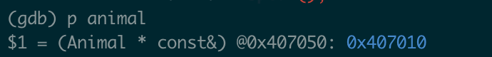

# Bitcask: A Log-Structured Hash Table for Fast Key/Value Data

Bitcask 的起源和 Riak 分布式数据库的历史紧密的联系在一起。在一个 Riak的 kv 集群，每个节点都使用了可插拔的本地存储，几乎任何 kv形式的引擎都可以用做每个服务器上的存储引擎。这种可插拔的特性可以使存储引擎在不影响极限代码的情况下，可以单独的测试和优化。

许多此类本地键值存储已经存在，包括但不限于Berkeley DB、Tokyo Cabinet和Innostore。我们在评估这些存储引擎时设定了多个目标，其中包括：

* 读写的低延时
* 高吞吐，特别是写入随机的数据流时
* 能够处理远超 RAM 的数据集
* crash优化，快速恢复和不丢数据
* 易于备份和恢复
* 相对简单，可理解的代码结构和数据格式
* 在大负载和大容量时有可预期的行为
* license 允许用到 riak

满足部分条件的存储有很多，但是全部满足这些条件的存储基本没有。

现有的存储系统在满足上述目标方案均未达到理想状态，我们在与Eric Brewer讨论这个问题时，他提出了一个关键见解：哈希表日志合并，这样可以做到甚至超过 LSM 的水平。

这使我们探索了log-structured 文件系统中用的一些技术，这些探索引领了 Bitcask的开发，能够满足上述所有特点的存储系统。尽管最开始 Bitcask是用于 Riak的，但它是一个通用性的 kv存储，也可以用在其他存储上。

我们最终采用的模型在概念上非常简单。一个 Bitcask的实例就是一个目录，同一时间只允许一个进程打开一个实例写入。可以把这个进程当做数据库进程。在任意时刻，只有一个文件是 active 的，可以被数据库写。当文件大小达到一个阈值后，该文件就会被关闭，然后创建一个新active文件。一旦一个文件被 close，有可能是到了大小限制，也有可能是服务退出，但不允许再次被打开写入。

active file只支持追加的写入，这也意味着顺序写不需要磁盘寻址（指 HDD）。

<figure><figcaption>
kv entry 格式
</figcaption></figure>

