# Google Spanner（中文版）

> 原文：*Spanner: Google’s Globally-Distributed Database*
>
> 翻译者：厦门大学计算机系教师林子雨；翻译时间：2012 年 9 月。
>
> 本 Markdown 由完整中文 PDF 转换而来，保留正文、公式图、表格、图注、致谢和参考文献。

<!-- 原译本第 1 页 -->

## 摘要

Spanner 是谷歌公司研发的、 可扩展的、 多版本、全球分布式、 同步复制数据库。它是第一个把数据分布在全球范围内的系统，并且支持外部一致性的分布式事务。本文描述了 Spanner 的架构、特性、不同设计决策的背后机理和一个新的时间 API，这个 API 可以暴露时钟的不确定性。这个 API 及其实现， 对于支持外部一致性和许多强大特性而言， 是非常重要的，这些强大特性包括：非阻塞的读、不采用锁机制的只读事务、原子模式变更。

## 关键词

Google Spanner, Bigtable, distributed database

## 全文目录结构

- [1. 介绍](#1-介绍)
- [2. 实现](#2-实现)
  - [2.1 Spanserver 软件栈](#21-spanserver-软件栈)
  - [2.2 目录和放置](#22-目录和放置)
  - [2.3 数据模型](#23-数据模型)
- [3. TrueTime](#3-truetime)
- [4. 并发控制](#4-并发控制)
  - [4.1 时间戳管理](#41-时间戳管理)
  - [4.2 细节](#42-细节)
- [5. 实验分析](#5-实验分析)
  - [5.1 微测试基准](#51-微测试基准)
  - [5.2 可用性](#52-可用性)
  - [5.3 TrueTime](#53-truetime)
  - [5.4 F1](#54-f1)
- [6. 相关工作](#6-相关工作)
- [7. 未来的工作](#7-未来的工作)
- [8. 总结](#8-总结)
- [致谢](#致谢)
- [参考文献](#参考文献)

## 1 介绍

Spanner 是一个可扩展的、全球分布式的数据库，是在谷歌公司设计、开发和部署的。在最高抽象层面，Spanner 就是一个数据库，把数据分片存储在许多Paxos[21]状态机上，这些机器位于遍布全球的数据中心内。复制技术可以用来服务于全球可用性和地理局部性。客户端会自动在副本之间进行失败恢复。随着数据的变化和服务器的变化，Spanner 会自动把数据进行重新分片，从而有效应对负载变化和处理失败。Spanner 被设计成可以扩展到几百万个机器节点，跨越成百上千个数据中心，具备几万亿数据库行的规模。应用可以借助于 Spanner 来实现高可用性， 通过在一个洲的内部和跨越不同的洲之间复制数据，保证即使面对大范围的自然灾害时数据依然可用。我们最初的客户是 F1[35]，一个

<!-- 原译本第 2 页 -->

谷歌广告后台的重新编程实现。F1 使用了跨越美国的 5 个副本。绝大多数其他应用很可能会在属于同一个地理范围内的 3-5 个数据中心内放置数据副本，采用相对独立的失败模式。也就是说，许多应用都会首先选择低延迟，而不是高可用性， 只要系统能够从1-2 个数据中心失败中恢复过来。Spanner 的主要工作，就是管理跨越多个数据中心的数据副本，但是，在我们的分布式系统体系架构之上设计和实现重要的数据库特性方面，我们也花费了大量的时间。尽管有许多项目可以很好地使用 BigTable[9]，我们也不断收到来自客户的抱怨，客户反映 BigTable 无法应用到一些特定类型的应用上面， 比如具备复杂可变的模式， 或者对于在大范围内分布的多个副本数据具有较高的一致性要求。其他研究人员也提出了类似的抱怨[37]。谷歌的许多应用已经选择使用 Megastore[5]，主要是因为它的半关系数据模型和对同步复制的支持，尽管 Megastore 具备较差的写操作吞吐量。由于上述多个方面的因素，Spanner 已经从一个类似 BigTable 的单一版本的键值存储， 演化成为一个具有时间属性的多版本的数据库。数据被存储到模式化的、 半关系的表中， 数据被版本化， 每个版本都会自动以提交时间作为时间戳，旧版本的数据会更容易被垃圾回收。应用可以读取旧版本的数据。Spanner 支持通用的事务，提供了基于 SQL 的查询语言。作为一个全球分布式数据库，Spanner 提供了几个有趣的特性：第一，在数据的副本配置方面，应用可以在一个很细的粒度上进行动态控制。应用可以详细规定， 哪些数据中心包含哪些数据，数据距离用户有多远（控制用户读取数据的延迟） ，不同数据副本之间距离有多远 （控制写操作的延迟）， 以及需要维护多少个副本 （控制可用性和读操作性能）。数据也可以被动态和透明地在数据中心之间进行移动，从而平衡不同数据中心内资源的使用。第二，Spanner 有两个重要的特性，很难在一个分布式数据库上实现，即 Spanner 提供了读和写操作的外部一致性， 以及在一个时间戳下面的跨越数据库的全球一致性的读操作。这些特性使得 Spanner 可以支持一致的备份、 一致的MapReduce 执行[12]和原子模式变更， 所有都是在全球范围内实现，即使存在正在处理中的事务也可以。之所以可以支持这些特性， 是因为Spanner 可以为事务分配全球范围内有意义的提交时间戳，即使事务可能是分布式的。这些时间戳反映了事务序列化的顺序。除此以外，这些序列化的顺序满足了外部一致性的要求： 如果一个事务T1 在另一个事务 T2 开始之前就已经提交了，那么，T1 的时间戳就要比 T2 的时间戳小。Spanner 是第一个可以在全球范围内提供这种保证的系统。实现这种特性的关键技术就是一个新的 TrueTime API 及其实现。这个 API 可以直接暴露时钟不确定性，Spanner 时间戳的保证就是取决于这个 API 实现的界限。如果这个不确定性很大，Spanner 就降低速度来等待这个大的不确定性结束。谷歌的簇管理器软件提供了一个TrueTime API 的实现。这种实现可以保持较小的不确定性（通常小于 10ms），主要是借助于现代时钟参考值（比如 GPS 和原子钟） 。第 2 部分描述了 Spanner 实现的结构、 特性集和工程方面的决策； 第3 部分介绍我们的新的 TrueTime API， 并且描述了它的实现； 第4 部分描述了 Spanner 如何使用 TrueTime 来实现外部一致性的分布式事务、 不用锁机制的只读事务和原子模式更新。第 5 部分提供了测试Spanner 性能和 TrueTime 行为的测试基准， 并讨论了F1 的经验。 第6、7 和 8 部分讨论了相关工作，并给出总结。

## 2 实现

本部分内容描述了 Spanner 的结构和背后的实现机理， 然后描述了目录抽象， 它被用来管理副本和局部性，并介绍了数据的转移单位。最后，将讨论我们的数据模型，从而说明，为什么 Spanner 看起来更加像一个关系数据库， 而不是一个键值数据库； 还会讨论应用如何

<!-- 原译本第 3 页 -->

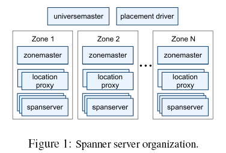

可以控制数据的局部性。一个 Spanner 部署称为一个 universe。假设 Spanner 在全球范围内管理数据，那么，将会只有可数的、运行中的 universe。我们当前正在运行一个测试用的 universe，一个部署/线上用的 universe 和一个只用于线上应用的 universe。Spanner 被组织成许多个 zone 的集合， 每个zone 都大概像一个 BigTable 服务器的部署。zone 是管理部署的基本单元。zone 的集合也是数据可以被复制到的位置的集合。当新的数据中心加入服务，或者老的数据中心被关闭时，zone 可以被加入到一个运行的系统中，或者从中移除。zone 也是物理隔离的单元，在一个数据中心中，可能有一个或者多个 zone，例如，属于不同应用的数据可能必须被分区存储到同一个数据中心的不同服务器集合中。

图 1 显示了在一个 Spanner 的 universe 中的服务器。一个 zone 包括一个 zonemaster，和一百至几千个 spanserver。Zonemaster 把数据分配给 spanserver，spanserver 把数据提供给客户端。 客户端使用每个 zone 上面的 location proxy 来定位可以为自己提供数据的spanserver。Universe master 和 placement driver，当前都只有一个。Universe master 主要是一个控制台，它显示了关于 zone 的各种状态信息，可以用于相互之间的调试。Placement driver 会周期性地与 spanserver 进行交互，来发现那些需要被转移的数据，或者是为了满足新的副本约束条件，或者是为了进行负载均衡。

### 2.1 Spanserver 软件栈

本部分内容主要关注 spanserver 实现， 来解释复制和分布式事务是如何被架构到我们的基于 BigTable 的实现之上的。图 2 显示了软件栈。在底部， 每个spanserver 负载管理 100-1000个称为 tablet 的数据结构的实例。一个 tablet 就类似于 BigTable 中的 tablet，也实现了下面的映射：

```text
(key: string, timestamp: int64) -> string
```

<!-- 原译本第 4 页 -->

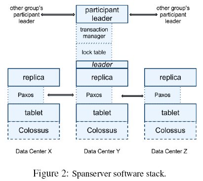

与 BigTable 不同的是，Spanner 会把时间戳分配给数据，这种非常重要的方式，使得Spanner 更像一个多版本数据库，而不是一个键值存储。一个 tablet 的状态是存储在类似于B-树的文件集合和写前(write-ahead)的日志中，所有这些都会被保存到一个分布式的文件系统中，这个分布式文件系统被称为 Colossus，它继承自 Google File System。为了支持复制，每个 spanserver 会在每个 tablet 上面实现一个单个的 Paxos 状态机。一个之前实现的 Spanner 可以支持在每个 tablet 上面实现多个 Paxos 状态机器，它可以允许更加灵活的复制配置， 但是， 这种设计过于复杂， 被我们舍弃了。每个状态机器都会在相应的tablet 中保存自己的元数据和日志。我们的 Paxos 实现支持采用基于时间的领导者租约的长寿命的领导者，时间通常在 0 到 10 秒之间。当前的 Spanner 实现中，会对每个 Paxos 写操作进行两次记录：一次是写入到 tablet 日志中，一次是写入到 Paxos 日志中。这种做法只是权宜之计，我们以后会进行完善。我们在 Paxos 实现上采用了管道化的方式，从而可以在存在广域网延迟时改进 Spanner 的吞吐量，但是，Paxos 会把写操作按照顺序的方式执行。Paxos 状态机是用来实现一系列被一致性复制的映射。每个副本的键值映射状态，都会被保存到相应的 tablet 中。写操作必须在领导者上初始化 Paxos 协议，读操作可以直接从底层的任何副本的 tablet 中访问状态信息， 只要这个副本足够新。副本的集合被称为一个 Paxos group。对于每个是领导者的副本而言， 每个spanserver 会实现一个锁表来实现并发控制。这个锁表包含了两阶段锁机制的状态：它把键的值域映射到锁状态上面。注意， 采用一个长寿命的 Paxos 领导者，对于有效管理锁表而言是非常关键的。在 BigTable 和 Spanner 中，我们都专门为长事务做了设计， 比如， 对于报表操作，可能要持续几分钟，当存在冲突时，采用乐观并发控制机制会表现出很差的性能。对于那些需要同步的操作， 比如事务型的读操作，需要获得锁表中的锁，而其他类型的操作则可以不理会锁表。对于每个扮演领导者角色的副本， 每个spanserver 也会实施一个事务管理器来支持分布式事务。这个事务管理器被用来实现一个 participant leader ，该组内的其他副本则是作为participant sl aves。如果一个事务只包含一个 Paxos 组（对于许多事务而言都是如此） ，它就可以绕过事务管理器，因为锁表和 Paxos 二者一起可以保证事务性。如果一个事务包含了多于一个 Paxos组，那些组的领导者之间会彼此协调合作完成两阶段提交。其中一个参与者组，会被选为协调者， 该组的participant leader 被称为 coordinator leader，该组的 participant slaves被称为 coordinator slaves。每个事务管理器的状态，会被保存到底层的 Paxos 组。

<!-- 原译本第 5 页 -->

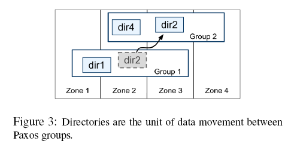

### 2.2 目录和放置

在一系列键值映射的上层，Spanner 实现支持一个被称为“目录”的桶抽象，也就是包含公共前缀的连续键的集合。（选择“目录”作为名称，主要是由于历史沿袭的考虑，实际上更好的名称应该是“桶” ） 。我们会在第 2.3 节解释前缀的源头。对目录的支持，可以让应用通过选择合适的键来控制数据的局部性。一个目录是数据放置的基本单元。属于一个目录的所有数据，都具有相同的副本配置。当数据在不同的 Paxos 组之间进行移动时，会一个目录一个目录地转移， 如图3 所示。Spanner可能会移动一个目录从而减轻一个 Paxos 组的负担， 也可能会把那些被频繁地一起访问的目录都放置到同一个组中， 或者会把一个目录转移到距离访问者更近的地方。当客户端操作正在进行时，也可以进行目录的转移。我们可以预期在几秒内转移 50MB 的目录。

一个 Paxos 组可以包含多个目录，这意味着一个 Spanner tablet 是不同于一个 BigTable tablet 的。一个 Spanner tablet 没有必要是一个行空间内按照词典顺序连续的分区，相反，它可以是行空间内的多个分区。我们做出这个决定， 是因为这样做可以让多个被频繁一起访问的目录被整合到一起。Movedir 是一个后台任务， 用来在不同的Paxos 组之间转移目录[14]。Movedir 也用来为Paxos 组增加和删除副本[25]， 因为Spanner 目前还不支持在一个 Paxos 内部进行配置的变更。Movedir 并不是作为一个事务来实现，这样可以避免在一个块数据转移过程中阻塞正在进行的读操作和写操作。相反，Movedir 会注册一个事实(fact)，表明它要转移数据，然后在后台运行转移数据。当它几乎快要转移完指定数量的数据时， 就会启动一个事务来自动转移那部分数据，并且为两个 Paxos 组更新元数据。一个目录也是一个应用可以指定的地理复制属性（即放置策略）的最小单元。 我们的放置规范语言的设计，把管理复制的配置这个任务单独分离出来。管理员需要控制两个维度：副本的数量和类型，以及这些副本的地理放置属性。他们在这两个维度里面创建了一个命名选项的菜单。通过为每个数据库或单独的目录增加这些命名选项的组合，一个应用就可以控制数据的复制。例如，一个应用可能会在自己的目录里存储每个终端用户的数据，这就有可能使得用户 A 的数据在欧洲有三个副本，用户 B 的数据在北美有 5 个副本。为了表达的清晰性， 我们已经做了尽量简化。事实上，当一个目录变得太大时，Spanner会把它分片存储。每个分片可能会被保存到不同的 Paxos 组上（因此就意味着来自不同的服务器）。Movedir 在不同组之间转移的是分片，而不是转移整个目录。

### 2.3 数据模型

Spanner 会把下面的数据特性集合暴露给应用：基于模式化的半关系表的数据模型，查询语言和通用事务。支持这些特性的动机， 是受到许多因素驱动的。需要支持模式化的半关系表是由 Megastore[5]的普及来支持的。在谷歌内部至少有 300 个应用使用 Megastore（尽管它具有相对低的性能），因为它的数据模型要比 BigTable 简单，更易于管理，并且支持在

<!-- 原译本第 6 页 -->

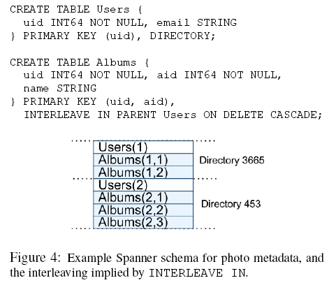

跨数据中心层面进行同步复制。 BigTable 只可以支持跨数据中心的最终事务一致性。 使用Megastore 的著名的谷歌应用是 Gmail,Picasa,Calendar,Android Market, AppEngine。在 Spanner中需要支持 SQL 类型的查询语言， 也很显然是非常必要的，因为 Dremel[28]作为交互式分析工具已经非常普及。 最后， 在 BigTable 中跨行事务 的缺乏来导致了用户频繁的抱怨；Percolator[32]的开发就是用来部分解决这个问题的。一些作者都在抱怨， 通用的两阶段提交的代价过于昂贵，因为它会带来可用性问题和性能问题[9][10][19]。我们认为，最好让应用程序开发人员来处理由于过度使用事务引起的性能问题，而不是总是围绕着 “缺少事务” 进行编程。在 Paxos 上运行两阶段提交弱化了可用性问题。应用的数据模型是架构在被目录桶装的键值映射层之上。 一个应用会在一个 universe中创建一个或者多个数据库。 每个数据库可以包含无限数量的模式化的表。每个表都和关系数据库表类似，具备行、列和版本值。我们不会详细介绍 Spanner 的查询语言，它看起来很像 SQL，只是做了一些扩展。Spanner 的数据模型不是纯粹关系型的，它的行必须有名称。更准确地说，每个表都需要有包含一个或多个主键列的排序集合。这种需求， 让Spanner 看起来仍然有点像键值存储：主键形成了一个行的名称，每个表都定义了从主键列到非主键列的映射。当一个行存在时，必须要求已经给行的一些键定义了一些值（即使是 NULL）。采用这种结构是很有用的， 因为这可以让应用通过选择键来控制数据的局部性。

图 4 包含了一个 Spanner 模式的实例， 它是以每个用户和每个相册为基础存储图片元数据。这个模式语言和 Megastore 的类似，同时增加了额外的要求，即每个 Spanner 数据库必须被客户端分割成一个或多个表的层次结构（hierarchy）。客户端应用会使用 INTERLEAVE IN语句在数据库模式中声明这个层次结构。 这个层次结构上面的表， 是一个目录表。目录表中的每行都具有键 K，和子孙表中的所有以 K 开始（以字典顺序排序）的行一起，构成了一个目录。ON DELETE CASCADE 意味着，如果删除目录中的一个行，也会级联删除所有相关的子孙行。这个图也解释了这个实例数据库的交织层次（interleaved layout ），例如 Albums(2,1)代表了来自 Albums 表的、对应于 user_id=2 和 album_id=1 的行。这种表的交织层次形成目录， 是非常重要的，因为它允许客户端来描述存在于多个表之间的位置关系，这对于一个分片的分布式数据库的性能而言是很重要的。没有它的话，Spanner 就无法知道最重要的位置关系。

<!-- 原译本第 7 页 -->

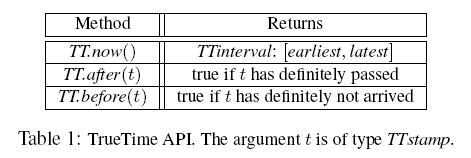

## 3 TrueTime

本部分内容描述 TrueTime API， 并大概给出它的实现方法。我们把大量细节内容放在另一篇论文中，我们的目标是展示这种 API 的力量。表 1 列出了 API 的方法。TrueTime 会显式地把时间表达成 TTinterval，这是一个时间区间，具有有界限的时间不确定性（不像其他的标准时间接口， 没有为客户端提供―不确定性‖这种概念）。TTinterval 区间的端点是 TTstamp类型。TT.now()方法会返回一个 TTinterval，它可以保证包含 TT.now()方法在调用时的绝对时间。这个时间和具备闰秒涂抹（leap-second smearing）的 UNIX 时间一样。把即时误差边界定义为 ε,平均误差边界为ε 。TT.after()和 TT.before()方法是针对 TT.now()的便捷的包装器。表示一个事件 e 的绝对时间， 可以利用函数$t_{abs}$(e)。 如果用更加形式化的术语，TrueTime可以保证，对于一个调用 tt=TT.now()，有 tt.earliest≤$t_{abs}$(enow)≤tt.latest，其中，是 enow 是调用的事件。在底层，TrueTime 使用的时间是 GPS 和原子钟。TrueTime 使用两种类型的时间，是因为它们有不同的失败模式。GPS 参考时间的弱点是天线和接收器失效、局部电磁干扰和相关失败（比如设计上的缺陷导致无法正确处理闰秒和电子欺骗），以及 GPS 系统运行中断。原子钟也会失效，不过失效的方式和 GPS 无关，不同原子钟之间的失效也没有彼此关联。由于存在频率误差，在经过很长的时间以后，原子钟都会产生明显误差。TrueTime 是由每个数据中心上面的许多 time master 机器和每台机器上的一个 timeslave daemon 来共同实现的。大多数 master 都有具备专用天线的 GPS 接收器，这些 master 在物理上是相互隔离的，这样可以减少天线失效、电磁干扰和电子欺骗的影响。剩余的 master（我们称为 Armageddon master）则配备了原子钟。一个原子钟并不是很昂贵：一个Armageddon master 的花费和一个 GPS master 的花费是同一个数量级的。所有 master 的时间参考值都会进行彼此校对。每个 master 也会交叉检查时间参考值和本地时间的比值，如果二者差别太大，就会把自己驱逐出去。在同步期间，Armageddon master 会表现出一个逐渐增加的时间不确定性， 这是由保守应用的最差时钟漂移引起的。GPS master 表现出的时间不确定性几乎接近于 0。每个 daemon 会从许多 master[29]中收集投票，获得时间参考值，从而减少误差。被选中的 master 中， 有些master 是 GPS master， 是从附近的数据中心获得的，剩余的 GPS master是从远处的数据中心获得的； 还有一些是Armageddon master。Daemon 会使用一个 Marzullo算法[27]的变种，来探测和拒绝欺骗，并且把本地时钟同步到非撒谎 master 的时间参考值。为了免受较差的本地时钟的影响，我们会根据组件规范和运行环境确定一个界限， 如果机器的本地时钟误差频繁超出这个界限，这个机器就会被驱逐出去。在同步期间，一个 daemon 会表现出逐渐增加的时间不确定性。ε 是从保守应用的最差时钟漂移中得到的。ε 也取决于 time master 的不确定性，以及与 time master 之间的通讯延迟。在我们的线上应用环境中，ε 通常是一个关于时间的锯齿形函数。在每个投票间隔中，ε 会在 1 到 7ms 之间变化。因此，在大多数情况下，ε 的值是 4ms。Daemon 的投票间隔，在当前是 30 秒，当前使用的时钟漂移比率是 200 微秒/秒， 二者一起意味着0 到 6ms 的锯齿形边界。剩余的 1ms 主要来自到 time master 的通讯延迟。在失败的时候，超过这个锯齿形边界也是有可能的。例如，偶尔的 time master 不确定性， 可能会引起整个数据中心范围内的ε

<!-- 原译本第 8 页 -->

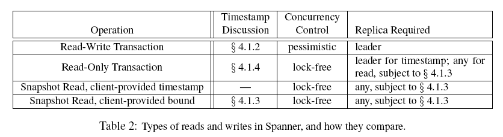

值的增加。类似的，过载的机器或者网络连接，都会导致 ε 值偶尔地局部增大。

## 4 并发控制

本部分内容描述 TrueTime 如何可以用来保证并发控制的正确性，以及这些属性如何用来实现一些关键特性， 比如外部一致性的事务、 无锁机制的只读事务、 针对历史数据的非阻塞读。这些特性可以保证，在时间戳为 t 的时刻的数据库读操作，一定只能看到在 t 时刻之前已经提交的事务。进一步说，把 Spanner 客户端的写操作和 Paxos 看到的写操作这二者进行区分，是非常重要的，我们把 Paxos 看到的写操作称为 Paxos 写操作。例如，两阶段提交会为准备提交阶段生成一个 Paxos 写操作，这时不会有相应的客户端写操作。

### 4.1 时间戳管理

表 2 列出了 Spanner 支持的操作的类型。Spanner 可以支持读写事务、只读事务（预先声明的快照隔离事务）和快照读。独立写操作， 会被当成读写事务来执行。非快照独立读操作， 会被当成只读事务来执行。二者都是在内部进行 retry， 客户端不用进行这种retry loop。

一个只读事务具备快照隔离的性能优势[6]。一个只读事务必须事先被声明不会包含任何写操作， 它并不是一个简单的不包含写操作的读写事务。在一个只读事务中的读操作， 在执行时会采用一个系统选择的时间戳， 不包含锁机制， 因此， 后面到达的写操作不会被阻塞。在一个只读事务中的读操作，可以到任何足够新的副本上去执行（见第 4.1.3 节）。一个快照读操作， 是针对历史数据的读取，执行过程中， 不需要锁机制。一个客户端可以为快照读确定一个时间戳，或者提供一个时间范围让 Spanner 来自动选择时间戳。 不管是哪种情况，快照读操作都可以在任何具有足够新的副本上执行。对于只读事务和快照读而言，一旦已经选定一个时间戳，那么，提交就是不可避免的，除非在那个时间点的数据已经被垃圾回收了。因此，客户端不必在 retry loop 中缓存结果。当一个服务器失效的时候，客户端就可以使用同样的时间戳和当前的读位置， 在另外一个服务器上继续执行读操作。

#### 4.1.1 Paxos 领导者租约

Spanner 的 Paxos 实现中使用了时间化的租约，来实现长时间的领导者地位（默认是 10秒）。一个潜在的领导者会发起请求，请求时间化的租约投票，在收到指定数量的投票后，这个领导者就可以确定自己拥有了一个租约。一个副本在成功完成一个写操作后， 会隐式地延期自己的租约。 对于一个领导者而言， 如果它的租约快要到期了， 就要显示地请求租约延期。另一个领导者的租约有个时间区间， 这个时间区间的起点就是这个领导者获得指定数量的投票那一刻， 时间区间的终点就是这个领导者失去指定数量的投票的那一刻（因为有些投票已经过期了）。Spanner 依赖于下面这些“不连贯性”：对于每个 Paxos 组，每个 Paxos 领导者的租约时间区间，是和其他领导者的时间区间完全隔离的。附录 A 显示了如何强制实现这些不连贯性。Spanner 实现允许一个 Paxos 领导者通过把 slave 从租约投票中释放出来这种方式， 实现领导者的退位。为了保持这种彼此隔离的不连贯性，Spanner 会对什么时候退位做出限制。

<!-- 原译本第 9 页 -->

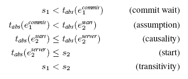

把 $s_{max}$ 定义为一个领导者可以使用的最大的时间戳。在退位之前，一个领导者必须等到TT.after($s_{max}$)是真。

#### 4.1.2 为读写事务分配时间戳

事务读和写采用两段锁协议。当所有的锁都已经获得以后，在任何锁被释放之前， 就可以给事务分配时间戳。对于一个给定的事务，Spanner 会为事务分配时间戳，这个时间戳是Paxos 分配给 Paxos 写操作的，它代表了事务提交的时间。Spanner 依赖下面这些单调性：在每个 Paxos 组内，Spanner 会以单调增加的顺序给每个Paxos 写操作分配时间戳，即使在跨越多个领导者时也是如此。一个单个的领导者副本，可以很容易地以单调增加的方式分配时间戳。在多个领导者之间就会强制实现彼此隔离的不连贯： 一个领导者必须只能分配属于它自己租约时间区间内的时间戳。 要注意到， 一旦一个时间戳 s 被分配，$s_{max}$ 就会被增加到 s，从而保证彼此隔离性（不连贯性）。Spanner 也会实现下面的外部一致性：如果一个事务 T2 在事务 T1 提交以后开始执行，那么， 事务T2 的时间戳一定比事务 T1 的时间戳大。对于一个事务 Ti 而言，定义开始和提交事件$e_i^{start}$ 和$e_i^{commit}$ ，事务提交时间为 si。对外部一致性的要求就变成了：

$$t_{abs}(e_1^{commit}) < t_{abs}(e_2^{start}) \Rightarrow s_1 < s_2$$

执行事务的协议和分配时间戳的协议，遵守两条规则，二者一起保证外部一致性。对于一个写操作 Ti 而言，担任协调者的领导者发出的提交请求的事件为$e_i^{server}$ 。Start. 为一个事务 Ti 担任协调者的领导者分配一个提交时间戳 si，不会小于 TT.now().latest的值，TT.now().latest 的值是在$e_i^{server}$ 事件之后计算得到的。要注意， 担任参与者的领导者，在这里不起作用。第 4.2.1 节描述了这些担任参与者的领导者是如何参与下一条规则的实现的。Commit Wait. 担任协调者的领导者， 必须确保客户端不能看到任何被Ti 提交的数据， 直到TT.after(si)为真。提交等待， 就是要确保si 会比 Ti 的绝对提交时间小。提交等待的实现在 4.2.1节中描述。证明如下：

#### 4.1.3 在某个时间戳下的读操作

第 4.1.2 节中描述的单调性，使得 Spanner 可以正确地确定一个副本是否足够新，从而能够满足一个读操作的要求。每个副本都会跟踪记录一个值，这个值被称为安全时间 $t_{safe}$，它是一个副本最近更新后的最大时间戳。如果一个读操作的时间戳是 t，当满足 t<=$t_{safe}$ 时，这个副本就可以被这个读操作读取。这里定义 $t_{safe}$=min($t_{safe}^{Paxos}$ , $t_{safe}^{TM}$ )，其中，每个 Paxos 状态机都有一个安全时间$t_{safe}^{Paxos}$ ，每个事务管理器都有一个安全时间$t_{safe}^{TM}$ 。$t_{safe}^{Paxos}$ 比较简单：就是最高应用的 Paxos 写操作的时间戳。由于时间戳会单调增加，写操作也是被顺序应用的，在小于$t_{safe}^{Paxos}$ 以后，写操作就不会发生。对于一个副本而言，如果有 0 个处于准备阶段（没有提交）的事务，$t_{safe}^{TM}$ 是无穷的。对于一个参与的 slave 而言，$t_{safe}^{TM}$ 实际上会引用副本的领导者的事务管理器，slave 可以根据Paxos 写操作传递的元数据来推断事务管理器的状态。如果存在许多这样的事务，那么这些

<!-- 原译本第 10 页 -->

事务对状态的影响是不确定的：一个参与者副本不知道这种事务是否需要提交。正如我们在第 4.2.1 节讨论的那样，提交协议会确保每个参与者会知道一个处于准备提交阶段的事务的时间戳的下界。对于事务 Ti 的每个参与领导者（对于一个组 g 而言）， 会为准备提交的记录分配一个准备时间戳$s_{i,g}^{prepare}$ 。担任协调者角色的领导者，会确保在所有参与者组 g 的事务提交的时间戳 si>=$s_{i,g}^{prepare}$ 。因此，在一个组 g 中的每个副本，对于在 g 中准备的所有事务Ti，都有$t_{safe}^{TM}$ =mini($s_{i,g}^{prepare}$ )-1。

#### 4.1.4 为只读事务分配时间戳

一个只读事务分成两个阶段执行：分配一个时间戳 $s_{read}$[8]，然后当成 $s_{read}$ 时刻的快照读来执行事务读操作。快照读可以在任何足够新的副本上面执行。在一个事务开始后的任意时刻， 可以简单地分配 $s_{read}$=TT.now().latest，通过第 4.1.2 节中描述过的类似的方式来维护外部一致性。但是，对于时间戳 $s_{read}$ 而言，如果 $t_{safe}$ 没有增加到足够大，可能需要对 $s_{read}$ 时刻的读操作进行阻塞。除此以外还要注意，选择一个 $s_{read}$ 的值可能也会增加 $s_{max}$ 的值，从而保证不连贯性。为了减少阻塞的概率，Spanner 应该分配可以保持外部一致性的最老的时间戳。第 4.2.2 节描述了如何选择这种时间戳。

### 4.2 细节

这部分内容介绍一些读写操作和只读操作的实践细节，以及用来实现原子模式变更的特定事务的实现方法。然后，描述一些基本模式的细化。

#### 4.2.1 读写事务

就像 Bigtable 一样，发生在一个事务中的写操作会在客户端进行缓存， 直到提交。由此导致的结果是，在一个事务中的读操作，不会看到这个事务的写操作的结果。这种设计在Spanner 中可以很好地工作，因为一个读操作可以返回任何数据读的时间戳，未提交的写操作还没有被分配时间戳。在读写事务内部的读操作，使用伤停等待（wound-wait）[33]来避免死锁。客户端对位于合适组内的领导者副本发起读操作，需要首先获得读锁， 然后读取最新的数据。当一个客户端事务保持活跃的时候， 它会发送 “保持活跃” 信息， 防止那些参与的领导者让该事务过时。当一个客户端已经完成了所有的读操作，并且缓冲了所有的写操作，它就开始两阶段提交。客户端选择一个协调者组， 并且发送一个提交信息给每个参与的、 具有协调者标识的领导者，并发送提交信息给任何缓冲的写操作。让客户端发起两阶段提交操作，可以避免在大范围连接内发送两次数据。一个参与其中的、 扮演非协调者角色的领导者， 首先需要获得写锁。然后， 它会选择一个预备时间戳， 这个时间戳应该比之前分配给其他事务的任何时间戳都要大（这样可以保持单调性），并且通过 Paxos 把准备提交记录写入日志。然后，每个参与者就把自己的准备时间戳通知给协调者。扮演协调者的领导者，也会首先获得写锁，但是，会跳过准备阶段。在从所有其他的、扮演参与者的领导者那里获得信息后， 它就会为整个事务选择一个时间戳。这个提交时间戳s 必须大于或等于所有的准备时间戳（这是为了满足第 4.1.3 节讨论的限制条件），在协调者收到它的提交信息时，s 应该大于 TT.now().latest， 并且s 应该大于这个领导者为之前的其他所有事务分配的时间戳（再次指出， 这样做是为了满足单调性）。这个扮演协调者的领导者，就会通过 Paxos 在日志中写入一个提交记录（或者当等待其他参与者发生超时就在日志中写入终止记录）。

<!-- 原译本第 11 页 -->

在允许任何协调者副本去提交记录之前，扮演协调者的领导者会一直等待到 TT.after(s)，从而可以保证遵循第 4.1.2 节中描述的提交等待规则。因为，扮演协调者的领导者会根据TT.now().latest 来选择 s，而且必须等待直到那个时间戳可以确保成为过去，预期的等待时间至少是 2*ε 。这种等待时间通常会和 Paxos 通信时间发生重叠。在提交等待之后，协调者就会发送一个提交时间戳给客户端和所有其他参与的领导者。每个参与的领导者会通过 Paxos把事务结果写入日志。所有的参与者会在同一个时间戳进行提交，然后释放锁。

#### 4.2.2 只读事务

分配一个时间戳需要一个协商阶段，这个协商发生在所有参与到该读操作中的Paxos组之间。由此导致的结果是，Spanner 需要为每个只读事务提供一个 scope 表达式，它可以指出整个事务需要读取哪些键。对于单独的查询，Spanner 可以自动计算出 scope。如果 scope 的值是由单个 Paxos 组来提供的，那么，客户端就会给那个组的领导者发起一个只读事务（当前的 Spanner 实现中， 只会为Paxos leader 中的只读事务选择一个时间戳），为那个领导者分配 $s_{read}$ 并且执行读操作。对于一个单个位置的读操作，Spanner 通常会比TT.now().latest 做得更好。我们把 LastTS()定义为在 Paxos 组中最后提交的写操作的时间戳。如果没有准备提交的事务，这个分配到的时间戳 $s_{read}$=LastTS()就很容易满足外部一致性要求：这个事务将可以看见最后一个写操作的结果，然后排队排在它之后。如果 scope 的值是由多个 Paxos 组来提供的，就会有几种选择。最复杂的选择就是，和所有组的领导者进行一轮沟通，大家根据 LastTS()进行协商得到 $s_{read}$。Spanner 当前实现了一个更加简单的选择。这个选择可以避免一轮协商，让读操作在 $s_{read}$=TT.now().latest 时刻去执行（这可能会等待安全时间的增加）。这个事务中的所有读操作，可以被发送到任何足够新的副本上执行。

#### 4.2.3 模式变更事务

TrueTime 允许 Spanner 支持原子模式变更。使用一个标准的事务是不可行的，因为参与者的数量（即数据库中组的数量）可能达到几百万个。Bigtable 可以支持在一个数据中心内进行原子模式变更，但是，这个操作会阻塞所有其他操作。一个 Spanner 模式变更事务通常是一个标准事务的、非阻塞的变种。首先，它会显式地分配一个未来的时间戳，这个时间戳会在准备阶段进行注册。由此，跨越几千个服务器的模式变更，可以在不打扰其他并发活动的前提下完成。其次，读操作和写操作，它们都是隐式地依赖于模式，它们都会和任何注册的模式变更时间戳t 保持同步： 当它们的时间戳小于t 时，读写操作就执行到时刻 t；当它们的时间戳大于时刻 t 时，读写操作就必须阻塞，在模式变更事务后面进行等待。如果没有 TrueTime， 那么定义模式变更发生在t 时刻， 就变得毫无意义。

#### 4.2.4 优化

$t_{safe}^{TM}$ 有一个弱点，那就是，一个单个的准备提交的事务，可能会阻止$t_{safe}^{TM}$ 继续增加。由此导致的结果是，在那以后的时间戳上就无法执行读操作，即使读操作不会和这个事务发生冲突。这种假冲突可以消除，方法是为$t_{safe}^{TM}$ 增加一个从键域（key ranges）到准备提交时间戳的细粒度的映射。这种信息可以存储到锁表， 锁表早已经把键域映射到锁元数据。当一个读操作到达时，它只需要针对键域与读操作发生冲突的、细粒度的安全时间进行检查。LastTS()也有一个缺陷：如果一个事务已经提交了，一个非冲突的只读事务就必须被分配 $s_{read}$，从而可以跟在那个事务后面。由此导致的结果是，读操作可能被延迟。消除这个弱点的方法是，为 LastTS()增加一个从键域（key ranges）到锁表中的提交时间戳的细粒度的映射（我们还没有实现这种优化） 。当一个只读事务到达时，它的时间戳就可以被分配，可以采用和这个事务冲突的键域的 LastTS()的最大值，除非有一个冲突的准备提交的事务 （这

<!-- 原译本第 12 页 -->

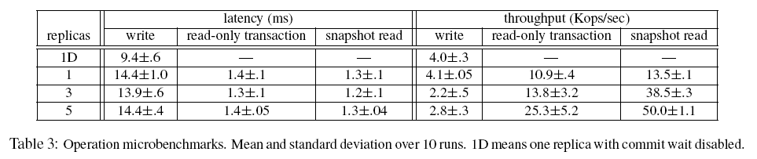

可以从细粒度安全时间里面确定） 。$t_{safe}^{Paxos}$ 有一个弱点：当存在 Paxos 写操作的时候，它就无法增加。也就是说，在 t 时刻快照读操作，不能在那些最后写操作发生在 t 之前的 Paxos 组中执行。Spanner 解决了这个问题，方法是充分利用领导者租约区间的隔离性。每个 Paxos 领导者会增加$t_{safe}^{Paxos}$ ，并且设置一个门槛值，未来的写操作时间戳会达到这个门槛值： 它维护了一个从 Paxos 序列号 n 到最小时间戳的映射 MinNextTS(n)，这个时间戳是允许分配给 Paxos 序列号 n+1 的最小时间戳。一个副本，当已经应用到 n 的时候，会把 $t_{safe}^{Paxos}$ 增加到 $MinNextTS(n)-1$。一个单个的领导者会比较容易实现它的 MinNextTS()。因为，MinNextTS()承诺的时间戳位于一个领导者租约内，在不同领导者之间可以保证实现前面讲过的“不连贯性” 。如果一个领导者希望在租约到期后继续增加 MinNextTS()，它就必须首先扩展它的租约。注意，为了保证不连贯性，$s_{max}$ 总会增加到 MinNextTS()中的最高值。在默认情况下，一个领导者会每隔 8 秒钟增加 MinNextTS()。因此，在缺少准备提交的事务的时候，在空闲 Paxos 组中工作正常的 slave，就可以为那些时间戳已经老化超过 8 秒的读操作提供服务。一个领导者也会根据 slave 的要求来增加 MinNextTS()的值。

## 5 实验分析

我们对 Spanner 性能进行了测试，包括复制、事务和可用性。然后，我们提供了一些关于 TrueTime 的实验数据，并且提供了我们的第一个用例——F1。

### 5.1 微测试基准

表 3 给出了一用于 Spanner 的微测试基准(microbenchmark)。这些测试是在分时机器上实现的：每个 spanserver 采用 4GB 内存和四核 CPU（AMD Barcelona 2200MHz）。客户端运行在单独的机器上。每个 zone 都包含一个 spanserver。客户端和 zone 都放在一个数据中心集合内，它们之间的网络距离不会超过 1ms。这种布局是很普通的， 许多数据并不需要把数据分散存储到全球各地） 。测试数据库具有 50 个 Paxos 组和 2500 个目录。操作都是独立的4KB 大小的读和写。All reads were served out of memory after a compaction，从而使得我们只需要衡量 Spanner 调用栈的开销。此外，还会进行一轮读操作，来预热任何位置的缓存。

对于延迟实验而言，客户端会发起足够少量的操作， 从而避免在服务器中发生排队。从1 个副本的实验中，提交等待大约是 5ms，Paxos 延迟大约是 9ms。随着副本数量的增加，延迟大约保持不变，只具有很少的标准差，因为在一个组的副本内，Paxos 会并行执行。随着副本数量的增加，获得指定投票数量的延迟对一个 slave 副本的慢速度不会很敏感。对于吞吐量的实验而言，客户端发起足够数量的操作，从而使得 CPU 处理能力达到饱和。快照读操作可以在任何足够新的副本上进行，因此， 快照读的吞吐量会随着副本的数量增加而线性增加。单个读的只读事务， 只会在领导者上执行，因为， 时间戳分配必须发生在领导者上。只读事务吞吐量会随着副本数量的增加而增加，因为有效的 spanserver 的数量会增加：在这个实验的设置中，spanserver 的数量和副本的数量相同，领导者会被随机分配到不同的 zone。写操作的吞吐量也会从这种实验设置中获得收益（副本从 3 变到 5 时写操作吞吐量增加了，就能够说明这点），但是，随着副本数量的增加，每个写操作执行时需要完成的工作量也会线性增加，这就会抵消前面的收益。表 4 显示了两阶段提交可以扩展到合理数量的参与者：它是对一系列实验的总结， 这些

<!-- 原译本第 13 页 -->

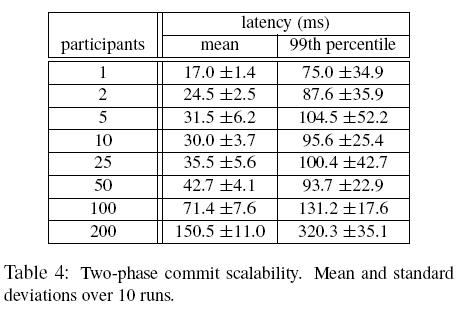

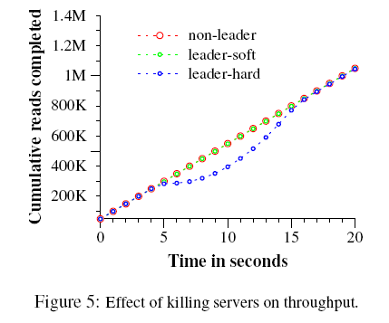

实验运行在 3 个 zone 上，每个 zone 具有 25 个 spanserver。扩展到 50 个参与者，无论在平均值还是第 99 个百分位方面， 都是合理的。在 100 个参与者的情形下， 延迟开发明显增加。

### 5.2 可用性

图 5 显示了在多个数据中心运行 Spanner 时的可用性方面的收益。它显示了三个吞吐量实验的结果，并且存在数据中心失败的情形， 所有三个实验结果都被重叠放置到一个时间轴上。测试用的 universe 包含 5 个 zone Zi，每个 zone 都拥有 25 个 spanserver。测试数据库被分片成 1250 个 Paxos 组，100 个客户端不断地发送非快照读操作，累积速率是每秒 50K 个读操作。所有领导者都会被显式地放置到 Z1。每个测试进行 5 秒钟以后，一个 zone 中的所有服务器都会被“杀死”：non-leader 杀掉 Z2，leader-hard 杀掉 Z1，leader-soft 杀掉 Z1，但是，它会首先通知所有服务器它们将要交出领导权。

杀掉 Z2 对于读操作吞吐量没有影响。杀掉 Z1，给领导者一些时间来把领导权交给另一个 zone 时， 会产生一个小的影响：吞吐量会下降， 不是很明显， 大概下降3-4%。另一方面，没有预警就杀掉 Z1 有一个明显的影响：完成率几乎下降到 0。随着领导者被重新选择，系统的吞吐量会增加到大约每秒 100K 个读操作，主要是由于我们的实验设置：系统中有额外的能力， 当找不到领导者时操作会排队。由此导致的结果是， 系统的吞吐量会增加直到到达系统恒定的速率。我们可以看看把 Paxos 领导者租约设置为 10ms 的效果。当我们杀掉这个 zone，对于这个组的领导者租约的过期时间，会均匀地分布到接下来的 10 秒钟内。来自一个死亡的领导者的每个租约一旦过期，就会选择一个新的领导者。大约在杀死时间过去 10 秒钟以后，所

<!-- 原译本第 14 页 -->

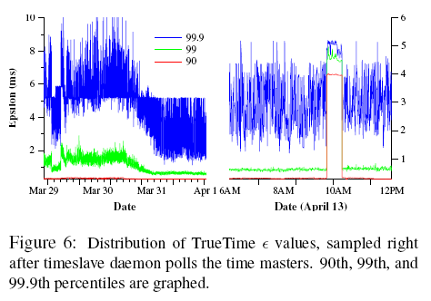

有的组都会有领导者， 吞吐量就恢复了。短的租约时间会降低服务器死亡对于可用性的影响，但是， 需要更多的更新租约的网络通讯开销。我们正在设计和实现一种机制，它可以在领导者失效的时候，让 slave 释放 Paxos 领导者租约。

### 5.3 TrueTime

关于 TrueTime， 必须回答两个问题：ε 是否就是时钟不确定性的边界？ε 会变得多糟糕？对于第一个问题，最严峻的问题就是，如果一个局部的时钟漂移大于 200us/sec，那就会破坏 TrueTime 的假设。我们的机器统计数据显示，坏的 CPU 的出现概率要比坏的时钟出现概率大 6 倍。也就是说，与更加严峻的硬件问题相比，时钟问题是很少见的。由此， 我们也相信，TrueTime 的实现和 Spanner 其他软件组件一样，具有很好的可靠性，值得信任。图 6 显示了 TrueTime 数据，是从几千个 spanserver 中收集的， 这些spanserver 跨越了多个数据中心， 距离2200 公里以上。图中描述了 ε 的第 90 个、99 个和 99.9 个百分位的情况，是在对 timemaster 进行投票后立即对 timeslave daemon 进行样本抽样的。 这些抽样数据没有考虑由于时钟不确定性带来的 ε 值的锯齿，因此测量的是 timemaster 不确定性（通常是 0）再加上通讯延迟。

图 6 中的数据显示了，在决定 ε 的基本值方面的上述两个问题，通常都不会是个问题。但是，可能会存在明显的拖尾延迟问题，那会引起更高的 ε 值。图中，3 月 30 日拖尾延迟的降低，是因为网络的改进，减少了瞬间网络连接的拥堵。在 4 月 13 日 ε 的值增加了，持续了大约 1 个小时，主要是因为例行维护时关闭了两个 time master。我们会继续调研并且消除引起 TrueTime 突变的因素。

### 5.4 F1

Spanner 在 2011 年早期开始进行在线负载测试， 它是作为谷歌广告后台F1[35]的重新实现的一部分。这个后台最开始是基于 MySQL 数据库，在许多方面都采用手工数据分区。未经压缩的数据可以达到几十 TB，虽然这对于许多 NoSQL 实例而言数据量是很小的， 但是，对于采用数据分区的 MySQL 而言，数据量是非常大的。MySQL 的数据分片机制，会把每个客户和所有相关的数据分配给一个固定的分区。这种布局方式， 可以支持针对单个客户的索引构建和复杂查询处理，但是， 需要了解一些商业知识来设计分区。随着客户数量的增长，对数据进行重新分区， 代价是很大的。最近一次的重新分区， 花费了两年的时间， 为了降低风险， 在多个团队之间进行了大量的合作和测试。这种操作太复杂了， 无法常常执行，由此导致的结果是，团队必须限制 MySQL 数据库的增长，方法是，把一些数据存储在外部的Bigtable 中，这就会牺牲事务和查询所有数据的能力。

<!-- 原译本第 15 页 -->

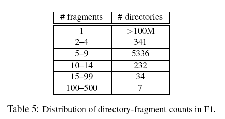

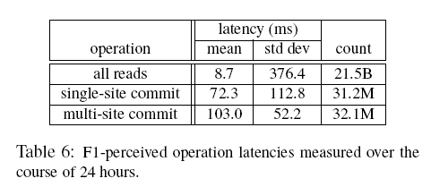

F1 团队选择使用 Spanner 有几个方面的原因。首先，Spanner 不需要手工分区。其次，Spanner 提供了同步复制和自动失败恢复。在采用 MySQL 的 master-slave 复制方法时，很难进行失败恢复，会有数据丢失和当机的风险。再次，F1 需要强壮的事务语义，这使得使用其他 NoSQL 系统是不实际的。应用语义需要跨越任意数据的事务和一致性读。F1 团队也需要在他们的数据上构建二级索引（因为 Spanner 没有提供对二级索引的自动支持） ，也有能力使用 Spanner 事务来实现他们自己的一致性全球索引。所有应用写操作， 现在都是默认从F1 发送到 Spanner。而不是发送到基于 MySQL 的应用栈。F1 在美国的西岸有两个副本，在东岸有三个副本。这种副本位置的选择，是为了避免发生自然灾害时出现服务停止问题，也是出于前端应用的位置的考虑。实际上，Spanner的失败自动恢复， 几乎是不可见的。在过去的几个月中， 尽管有不在计划内的机群失效，但是，F1 团队最需要做的工作仍然是更新他们的数据库模式，来告诉 Spanner 在哪里放置 Paxos领导者，从而使得它们尽量靠近应用前端。Spanner 时间戳语义， 使得它对于F1 而言， 可以高效地维护从数据库状态计算得到的、放在内存中的数据结构。F1 会为所有变更都维护一个逻辑历史日志，它会作为每个事务的一部分写入到 Spanner。F1 会得到某个时间戳下的数据的完整快照，来初始化它的数据结构，然后根据数据的增量变化来更新这个数据结构。表 5 显示了 F1 中每个目录的分片数量的分布情况。每个目录通常对应于 F1 上的应用栈中的一个用户。绝大多数目录 （同时意味着绝大多数用户）都只会包含一个分片，这就意味着，对于这些用户数据的读和写操作只会发生在一个服务器上。多于 100 个分片的目录，是那些包含 F1 二级索引的表：对这些表的多个分片进行写操作， 是极其不寻常的。F1 团队也只是在以事务的方式进行未经优化的批量数据加载时，才会碰到这种情形。

表 6 显示了从 F1 服务器来测量的 Spanner 操作的延迟。在东海岸数据中心的副本，在选择 Paxos 领导者方面会获得更高的优先级。表 6 中的数据是从这些数据中心的 F1 服务器上测量得到的。写操作延迟分布上存在较大的标准差，是由于锁冲突引起的肥尾效应（fat tail）。在读操作延迟分布上存在更大的标准差，部分是因为 Paxos 领导者跨越了两个数据中心，只有其中的一个是采用了固态盘的机器。此外，测试内容还包括系统中的每个针对两个数据中心的读操作：字节读操作的平均值和标准差分别是 1.6KB 和 119KB。

## 6 相关工作

Megastore[5]和 DynamoDB[3]已经提供了跨越多个数据中心的一致性复制。DynamoDB

<!-- 原译本第 16 页 -->

提供了键值存储接口，只能在一个 region 内部进行复制。Spanner 和 Megastore 一样，都提供了半关系数据模型，甚至采用了类似的模式语言。Megastore 无法活动高性能。Megastore是架构在 Bigtable 之上，这带来了很高的通讯代价。Megastore 也不支持长寿命的领导者，多个副本可能会发起写操作。来自不同副本的写操作，在Paxos 协议下一定会发生冲突，即使他们不会发生逻辑冲突： 会严重影响吞吐量， 在一个Paxos 组内每秒钟只能执行几个写操作。Spanner 提供了更高的性能，通用的事务和外部一致性。Pavlo 等人[31]对数据库和 MapReduce[12]的性能进行了比较。 他们指出了几个努力的方向，可以在分布式键值存储之上充分利用数据库的功能[1][4][7][41]，二者可以实现充分的融合。我们比较赞同这个结论，并且认为集成多个层是具有优势的：把复制和并发控制集成起来，可以减少 Spanner 中的提交等待代价。在一个采用了复制的存储上面实现事务， 可以至少追述到Gifford 的论文[16]。Scatter[17]是一个最近的基于 DHT 的键值存储，可以在一致性复制上面实现事务。Spanner 则要比Scatter 在更高的层次上提供接口。Gray 和 Lamport[18]描述了一个基于 Paxos 的非阻塞的提交协议， 他们的协议会比两阶段提交协议带来更多的代价， 而两阶段提交协议在大范围分布式的组中的代价会进一步恶化。Walter[36]提供了一个快照隔离的变种，但是无法跨越数据中心。相反，我们的只读事务提供了一个更加自然的语义，因为， 我们对于所有的操作都支持外部语义。最近， 在减少或者消除锁开销方面已经有大量的研究工作。Calvin[40]消除了并发控制：它会重新分配时间戳，然后以时间戳的顺序执行事务。HStore[39]和 Granola[11]都支持自己的事务类型划分方法，有些事务类型可以避免锁机制。但是， 这些系统都无法提供外部一致性。Spanner 通过提供快照隔离，解决了冲突问题。V oltDB[42]是一个分片的内存数据库，可以支持在大范围区域内进行主从复制，支持灾难恢复，但是没有提供通用的复制配置方法。它是一个被称为 NewSQL 的实例，这是实现可扩展的 SQL[38]的强大的市场推动力。许多商业化的数据库都可以支持历史数据读取，比如 Marklogic[26]和 Oracle’ Total Recall[30]。Lomet 和 Li[24]对于这种时间数据库描述了一种实现策略。Faresite 给出了与一个受信任的时钟参考值相关的时钟不确定性的边界[13]（要比TrueTime 更加宽松）：Farsite 中的服务器租约的方式，和 Spanner 中维护 Paxos 租约的方式相同。在之前的工作中[2][23]，宽松同步时钟已经被用来进行并发控制。我们已经展示了TrueTime 可以从 Paxos 状态机集合中推导出全球时间。

## 7 未来的工作

在过去一年的大部分时间里， 我们都是 F1 团队一起工作， 把谷歌的广告后台从MySQL迁移到 Spanner。我们正在积极改进它的监控和支撑工具，同时在优化性能。此外，我们已经开展了大量工作来改进备份恢复系统的功能和性能。我们当前正在实现Spanner 模式语言，自动维护二级索引和自动基于负载的分区。在未来，我们会调研更多的特性。以最优化的方式并行执行读操作， 是我们追求的有价值的策略，但是， 初级阶段的实验表明， 实现这个目标比较艰难。此外，我们计划最终可以支持直接变更 Paxos 配置[22]34]。我们希望许多应用都可以跨越数据中心进行复制，并且这些数据中心彼此靠近。TrueTime ε 可能会明显影响性能。把 ε 值降低到 1ms 以内，并不存在不可克服的障碍。Time-master-query 间隔可以继续减少，Time-master-query 延迟应该随着网络的改进而减少，或者通过采用分时技术来避免延迟。最后，还有许多有待改进的方面。尽管 Spanner 在节点数量上是可扩展的，但是与节点相关的数据结构在复杂的 SQL 查询上的性能相对较差，因为，它们是被设计成服务于简单

<!-- 原译本第 17 页 -->

的键值访问的。来自数据库文献的算法和数据结构，可以极大改进单个节点的性能。另外，根据客户端负载的变化，在数据中心之间自动转移数据，已经成为我们的一个目标，但是，为了有效实现这个目标，我们必须具备在数据中心之间自动、 协调地转移客户端应用进程的能力。转移进程会带来更加困难的问题——如何在数据中心之间管理和分配资源。

## 8 总结

总的来说，Spanner 对来自两个研究群体的概念进行了结合和扩充：一个是数据库研究群体， 包括熟悉易用的半关系接口， 事务和基于SQL 的查询语言； 另一个是系统研究群体，包括可扩展性，自动分区，容错，一致性复制，外部一致性和大范围分布。自从 Spanner 概念成形， 我们花费了5 年以上的时间来完成当前版本的设计和实现。花费这么长的时间， 一部分原因在于我们慢慢意识到，Spanner 不应该仅仅解决全球复制的命名空间问题，而且也应该关注 Bigtable 中所丢失的数据库特性。我们的设计中一个亮点特性就是 TrueTime。我们已经表明，在时间 API 中明确给出时钟不确定性， 可以以更加强壮的时间语义来构建分布式系统。此外，因为底层的系统在时钟不确定性上采用更加严格的边界，实现更强壮的时间语义的代价就会减少。作为一个研究群体，我们在设计分布式算法时，不再依赖于弱同步的时钟和较弱的时间API。

## 致谢

许多人帮助改进了这篇论文：Jon Howell，Atul Adya, Fay Chang, Frank Dabek, Sean Dorward,Bob Gruber, David Held, Nick Kline, Alex Thomson, and Joel Wein. 我们的管理层对于我们的工作和论文发表都非常支持：Aristotle Balogh, Bill Coughran, Urs H¨ olzle, Doron Meyer, Cos Nicolaou,Kathy Polizzi, Sridhar Ramaswany, and Shivakumar Venkataraman.我们的工作是在Bigtable和Megastore团队的工作基础之上开展的。F1团队， 尤其是Jeff Shute，和我们一起工作， 开发了数据模型， 跟踪性能和纠正漏洞。Platforms团队，尤其是Luiz Barroso和Bob Felderman，帮助我们一起实现了TrueTime。最后，许多谷歌员工都曾经在我们的团队工作过，包括Ken Ashcraft, Paul Cychosz, Krzysztof Ostrowski, Amir Voskoboynik, Matthew Weaver,Theo Vassilakis, and Eric Veach; or have joined our team recently: Nathan Bales, Adam Beberg,Vadim Borisov, Ken Chen, Brian Cooper, Cian Cullinan, Robert-Jan Huijsman, Milind Joshi, Andrey Khorlin, Dawid Kuroczko, Laramie Leavitt, Eric Li, Mike Mammarella, Sunil Mushran, Simon Nielsen,Ovidiu Platon, Ananth Shrinivas, Vadim Suvorov, and Marcel van der Holst.

## 参考文献

[1] Azza Abouzeid et al. ―HadoopDB: an architectural hybrid of MapReduce and DBMS technologies for analytical workloads‖. Proc. of VLDB. 2009, pp. 922–933.

[2] A. Adya et al. ―Efficient optimistic concurrency control using loosely synchronized clocks‖. Proc.of SIGMOD. 1995, pp. 23–34.

[3] Amazon. Amazon DynamoDB. 2012.

[4] Michael Armbrust et al. ―PIQL: Success-Tolerant Query Processing in the Cloud‖. Proc. of VLDB.2011, pp. 181–192.

[5] Jason Baker et al. ―Megastore: Providing Scalable, Highly Available Storage for Interactive Services‖. Proc. of CIDR. 2011, pp. 223–234.

[6] Hal Berenson et al. ―A critique of ANSI SQL isolation levels‖. Proc. of SIGMOD. 1995, pp. 1–10.

[7] Matthias Brantner et al. ―Building a database on S3‖. Proc. of SIGMOD. 2008, pp. 251–264.

<!-- 原译本第 18 页 -->

[8] A. Chan and R. Gray. ―Implementing Distributed Read-Only Transactions‖. IEEE TOSE SE-11.2 (Feb. 1985), pp. 205–212.

[9] Fay Chang et al. ―Bigtable: A Distributed Storage System for Structured Data‖. ACM TOCS 26.2 (June 2008), 4:1–4:26.

[10] Brian F. Cooper et al. ―PNUTS: Yahoo!’s hosted data serving  platform‖. Proc. of VLDB. 2008, pp.1277–1288.

[11] James Cowling and Barbara Liskov. ―Granola: Low-Overhead Distributed Transaction Coordination‖. Proc. of USENIX ATC. 2012, pp. 223–236.

[12] Jeffrey Dean and Sanjay Ghemawat. ―MapReduce: a flexible data processing tool‖. CACM 53.1 (Jan. 2010), pp. 72–77.

[13] John Douceur and Jon Howell. Scalable Byzantine-Fault-Quantifying Clock Synchronization.Tech. rep. MSR-TR-2003-67. MS Research, 2003.

[14] John R. Douceur and Jon Howell. ―Distributed directory service in the Farsite file system‖. Proc.of OSDI. 2006, pp. 321–334.

[15] Sanjay Ghemawat, Howard Gobioff, and Shun-Tak Leung. ―The Google file system‖. Proc. of SOSP. Dec. 2003, pp. 29–43.

[16] David K. Gifford. Information Storage in a Decentralized Computer System. Tech. rep. CSL-81-8.PhD dissertation. Xerox PARC, July 1982.

[17] Lisa Glendenning et al. ―Scalable consistency in Scatter‖. Proc. of SOSP. 2011.

[18] Jim Gray and Leslie Lamport. ―Consensus on transaction commit‖. ACM TODS 31.1 (Mar. 2006),pp. 133–160.

[19] Pat Helland. ―Life beyond Distributed Transactions: an Apostate’s  Opinion‖. Proc. of CIDR. 2007,pp. 132–141.

[20] Maurice P. Herlihy and Jeannette M. Wing. ―Linearizability: a correctness condition for concurrent objects‖. ACM TOPLAS 12.3 (July 1990), pp. 463–492.

[21] Leslie Lamport. ―The part-time parliament‖. ACM TOCS 16.2 (May 1998), pp. 133–169.

[22] Leslie Lamport, Dahlia Malkhi, and Lidong Zhou. ―Reconfiguring a state machine‖. SIGACT News 41.1 (Mar. 2010), pp. 63–73.

[23] Barbara Liskov. ―Practical uses of synchronized clocks in distributed systems‖. Distrib. Comput.6.4 (July 1993), pp. 211–219.

[24] David B. Lomet and Feifei Li. ―Improving Transaction-Time DBMS Performance and Functionality‖. Proc. of ICDE (2009), pp. 581–591.

[25] Jacob R. Lorch et al. ―The SMART way to migrate replicated stateful services‖. Proc. of EuroSys.2006, pp. 103–115.

[26] MarkLogic. MarkLogic 5 Product Documentation. 2012.

[27] Keith Marzullo and Susan Owicki. ―Maintaining the time in a distributed system‖. Proc. of PODC.1983, pp. 295–305.

[28] Sergey Melnik et al. ―Dremel: Interactive Analysis of Web-Scale Datasets‖. Proc. of VLDB. 2010,pp. 330–339.

[29] D.L. Mills. Time synchronization in DCNET hosts. Internet Project Report IEN–173. COMSAT Laboratories, Feb. 1981.

[30] Oracle. Oracle Total Recall. 2012.

[31] Andrew Pavlo et al. ―A comparison of approaches to large -scale data analysis‖. Proc. of SIGMOD.2009, pp. 165–178.

<!-- 原译本第 19 页 -->

[32] Daniel Peng and Frank Dabek. ―Large-scale incremental processing using distributed transactions and notifications‖. Proc. of OSDI. 2010, pp. 1–15.

[33] Daniel J. Rosenkrantz, Richard E. Stearns, and Philip M. Lewis II. ―System level concurrency control for distributed database systems‖. ACM TODS 3.2 (June 1978), pp. 178–198.

[34] Alexander Shraer et al. ―Dynamic Reconfiguration of Primary/Backup Clusters‖. Proc. of SENIX ATC. 2012, pp. 425–438.

[35] Jeff Shute et al. ―F1—The Fault-Tolerant Distributed RDBMS Supporting Google’s Ad Business‖.Proc. of SIGMOD. May 2012, pp. 777–778.

[36] Yair Sovran et al. ―Transactional storage for geo-replicated systems‖. Proc. of SOSP. 2011, pp.385–400.

[37] Michael Stonebraker. Why Enterprises Are Uninterested in NoSQL. 2010.

[38] Michael Stonebraker. Six SQL Urban Myths. 2010.

[39] Michael Stonebraker et al. ―The end of an architectural era: (it’s time for a complete rewrite)‖.Proc. of VLDB. 2007, pp. 1150–1160.

[40] Alexander Thomson et al. ―Calvin: Fast Distributed Transactions for Partitioned Database Systems‖. Proc. of SIGMOD.2012, pp. 1–12.

[41] Ashish Thusoo et al. ―Hive — A Petabyte Scale Data Warehouse Using Hadoop‖. Proc. of ICDE. 2010, pp. 996–1005.

[42] V oltDB. V oltDB Resources. 2012.
