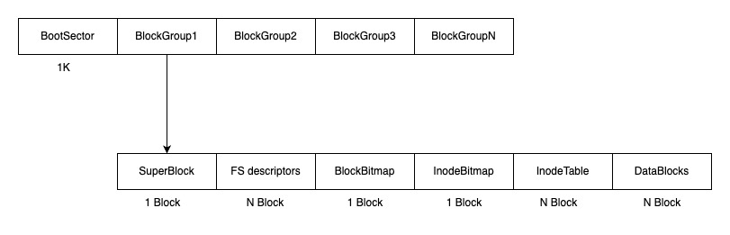

# Ext2 Filesystem

### 1. Ext2 Disk Layout

<figure><figcaption></figcaption></figure>

ext2文件系统的磁盘layout如上图所示：

其中前1024字节是启动block，给系统引导扇区预留的，ext2不会去使用这一块数据。剩下的空间被分成了N个block group，其中每个block group的结构都是一样的。

superblock的定义如下：

```clike
struct ext2_superblock {
    uint32_t s_inodes_count;       // total inodes count
    uint32_t s_blocks_count;       // total blocks count
    uint32_t s_r_blocks_count;     // root reserved blocks
    uint32_t s_free_blocks_count;  // free blocks count
    uint32_t s_free_inodes_count;  // free inodes count
    uint32_t s_first_data_block;   // Block number of the block containing the superblock
    uint32_t s_log_block_size;
    uint32_t s_log_frag_size;
    uint32_t s_blocks_per_group;
    uint32_t s_frags_per_group;
    uint32_t s_inodes_per_group;
    uint32_t s_mtime;  // Last mount time
    uint32_t s_wtime;  // Last written time

    uint16_t s_mnt_count;        // Number of times the volume has been mounted since its last consistency check
    uint16_t s_max_mnt_count;    // Number of mounts allowed before a consistency check must be done
    uint16_t s_magic;            // Ext2 signature (0xef53)
    uint16_t s_state;            // File system state
    uint16_t s_errors;           // What to do when an error is detected
    uint16_t s_minor_rev_level;  // Minor portion of version

    uint32_t s_lastcheck;      // POSIX time of last consistency check
    uint32_t s_checkinterval;  // Interval (in POSIX time) between forced consistency checks
    uint32_t s_creator_os;     // Operating system ID from which the filesystem on this volume was created
    uint32_t s_rev_level;      // Major portion of version

    uint16_t s_def_resuid;  // User ID that can use reserved blocks
    uint16_t s_def_resgid;  // Group ID that can use reserved blocks

    uint32_t s_first_ino;
    uint16_t s_inode_size;
}
```

\
每个block group起始都是一个superblock，记录了ext2自己的一些信息，比如block size，inode size等等信息。ext2通过读取superblock计算blocksize大小，blocksize=1024 << superblock->s\_log\_block\_size。

接着是group descriptor列表，group descriptor记载了block group元信息，superblock和group descriptor每个block group都有一份冗余，包括block bitmap,inode bitmap,inodetablet等结构。

```clike
struct ext2_group_desc {
    uint32_t bg_block_bitmap;       // Block address of block usage bitmap
    uint32_t bg_inode_bitmap;       // Block address of inode usage bitmap
    uint32_t bg_inode_table;        // Starting block address of inode table
    uint16_t bg_free_blocks_count;  // Number of unallocated blocks in group
    uint16_t bg_free_inodes_count;  // Number of unallocated inodes in group
    uint16_t bg_used_dirs_count;    // Number of directories in group
    uint16_t bg_pad;
    uint8_t  bg_reserved[12];
};
```

block\_bitmap和inode\_bitmap分别表示本block group的block和inode使用情况，0代表block或者inode未被使用，1代表已经使用了，他们的长度分别是1k，这样一个block group最多有8\*1024个block或者inode。

inodetable记录了block group预定义的所有的inode，它的offset记录在group descriptor里，bg\_inode\_table字段。


